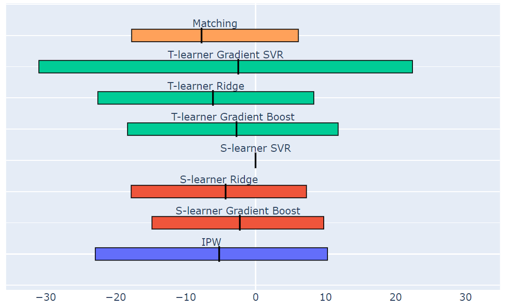



***Causal Inference 097400 – Final Project***

**The Causal Effect of a Dog’s Ease of Training on its Popularity**

*Gal Goldstein and Yonatan Kudlech*

**Introduction**

Nowadays the dog is the most popular pet. There are about 340 different breeds of dogs in the world [1], and this diversity of breeds creates large variability between dogs. The variability takes place in different characteristics of the animal, one of them is the trainability of the dog, i.e., how easy it will be for a pet owner to raise the pet. The trainability goes hand in hand with the intelligence of the pet, which differs between the breeds. 

There can be many reasons for the gap in trainability between one breed to another. Some of them are known to us and some are not. 

There are also many reasons why a dog breed is popular among pet owners. for example, the Labrador dog breed is the most popular in America [2]. It might be because Labradors are friendly, helpful, playful, and highly trainable. But there can be also esoteric hidden reasons for dog popularity, for example, after the release of the movie ‘Men in Black’, the popularity of the pug breed skyrocketed.

In this work we will delve into the question: is There a causal effect of a dog’s ease of training on its popularity. 

To answer this question, we will first have to understand the confounders that affect both ease of training and popularity. Then, we will apply causal inference methods, and construct causal model that will yield evaluated findings regard this question.

**Data**

The Best-in-Show dataset [3] published in 2014, by Miriam Quick and David McCandless.

It contains information about 172 different dog breeds.

Each sample represents a dog breed, and it has the following attributes:

- ` `Dog category: Categorical attribute, represent the dog role group. Contain values such as: herding, sporting, working, toy, hound.
- Popularity ranking: discrete ordered attribute, contain the ranking of popularity within the dataset, values between 1 to 172, where the lowest is the most popular. 
- Trainability ranking: discrete ordered attribute, contain the ranking of ease of training within the dataset, values between 1 to 80, where the lowest is the easiest to train. There is another column of categorical trainability which takes the discrete ordered values between 1 to 80 and classify it to levels according to figure 1.

|Trainability ranking|Trainability category|
| :- | :- |
|1-10|Brightest|
|11-26|Excellent|
|27-39|Above average|
|40-54|Average|
|55-69|Fair|
|70-80|Lowest|
*Figure 1. Trainability ranking-category mapping*

- Longevity: continuous attribute, contain the life expectancy of the breed.
- Genetic diseases: discrete ordered attribute, contain the ranking of the genetic status, with values between 0 to 9, where the lowest is healthy breed without genetic diseases. The rank sums the tendency and severity of the diseases per breed. In addition, there is textual description of the diseases of each breed, for deeper analysis. 
- Cuteness: discrete ordered attribute, with values between 1 to 6.
- Size: Categorical attribute - small/medium/large. There are more columns which shows size further details as weights, and shoulder height. 
- More attributes: grooming required, suitability for children, costs

*Figure 2. Histograms per treatment of the 3 confounders*

Treatment: The treatment will be binary. We will divide the ‘Trainability’ values into two groups – treated and control, as detailed below.

Outcome: The popularity ranking values.

Confounders: In our belief, the attributes that affect both trainability and popularity, are:

- Dog category: affects the trainability since the category relates to the evolutionary destiny and can determine characteristics such as discipline. It affects the popularity from similar reasons. 
- Dog size: Researchers have shown that a dog's size may be associated with its ability to be successfully house-trained [4]. Popularity of dog is affected from its size because of different preferences of a dog owner.
- Genetic Disease: can impair the trainability, for example dog with vision problems might be more difficult to train. These diseases might also deter dog owners.

Possible unmeasured confounders: temperament, tendency to experience traumas/abuses.

Challenges:

- Missing data: The dataset creator gathered data from different sources (the sources appear in the link to dataset. Each attribute was collected from different source) and left missing values in some of the attributes. We can ignore the missing values in the attributes which we consider as non-confounders, but we remain with 42 samples with missing values at the attributes ‘Trainability’ (ranking & category) and ‘Genetic diseases’ (ranking & details). Our assumption is that this missingness mechanism is MCAR (**M**issing **C**ompletely **A**t **R**andom) because the missingness is absolutely depends at the sources where the data was collected from, and as said, each attribute has different source. The probability of specific breed to appear in a given source is equal to the probability of another breed. 
- Small dataset: the dataset contains only 172 samples, one for each breed. This can harm the reliability of the data distribution.

When we take in account these two challenges together, we get our main challenge which is difficulty to infer a confident and reliable conclusion about the causal effect. These challenges will restrict us in the complexity level of the methods we will use.

**Identification Stage**

We will discuss the identification stage of causal inference, which is to formulate causal assumptions sufficient to answer our research question.

First, we assume that the SUTVA (Stable Unit Treatment Value Assumption) holds since there is no interactions/network connections between the units (breeds) and each unit get the same form of treatment. We also assume that that the consistency assumption holds.

Secondly, we will discuss the ignorability assumption. The ignorability assumption says that there are no unmeasured confounders. In other words, the potential outcomes (popularity ranks) are independent of treatment assignment (trainability), conditioned on the observed covariates (dog category, dog size, genetic diseases). We discussed earlier about two other possible factors– temperament, tendency to traumas. We can rule out the possibility that these factors have unmeasured effect on the trainability and the popularity, since we see them as dependent on the category and the genetic status of the dog, which are measured. Since we could not think of additional confounders which are significant enough to impact the causal effect, we can assume that ignorability holds in our project. The lack of hidden confounders is demonstrated in the causal graph below.

The overlap assumption (AKA common support) says that each dog breed has a positive probability of receiving each treatment (easy to train/not easy to train). We assume that overlap holds in our project, as can be seen in the propensity score histogram in figure 3. The overlap between the histograms allowing causal analysis. 

*Figure 3. In orange: control group. In blue: treated group. One sample (in the right orange bin) which is not in the overlap area, was dropped from the dataset.*

*Figure 3. In orange: control group. In blue: treated group. One sample (in the right orange bin) which is not in the overlap area, was dropped from the dataset.*

Another way to show the existence of the common support, is by directly plotting the confounders values and the treatment. In figure 4 we can see the overlap since each treated sample has positive probability to be a control sample because of the closeness to the control samples, and vice versa.

*Figure 4. Left chart: terrier dog category, right chart: working dog category. X axe: Genetic ranking. Y axe: Size category. Magnitude of the color represent the number of samples in each location in the charts. Charts for full types of dog category are in the attached code.*

*Figure 4. Left chart: terrier dog category, right chart: working dog category. X axe: Genetic ranking. Y axe: Size category. Magnitude of the color represent the number of samples in each location in the charts. Charts for full types of dog category are in the attached code.*

The last identification-stage related point, is the backdoor criterion. We will expand the talk on the backdoor criterion in the ‘estimation stage’ section, for easier look on the causal graph.
**

**Estimation Stage**

Facing the data challenges:

We found the best way to deal the missing data is to ignore this samples. Filling these missing data with any imputation method will not perform good enough, since the small amount of data. Deletion will not reduce the statistical power of the analysis because the missingness mechanism is MCAR, as detailed before. After we ignore these samples, we left with 130 samples. We solved the missing data challenge, but still have the small dataset challenge. When the dataset is relatively small, the way to find a generalized enough model is to use simple models. Complex models don’t perform good when they meet small dataset, since they overfit it. We want to have good balance between the bias and the variance, and therefore simple models are the right solution to handle this challenge.

We chose to represent our causal problem with causal graph.

As mentioned before, our treatment is the trainability of the dog. In order to use various of methods we learned in the course, we will binarize this attribute to “is easy to train” treatment. We will consider the brightest, excellent, and above average categories as **easy to train, and will mark it as treatment=1**. The rest of the categories (average, fair, and lowest) will be considered as **hard to train and will be marked as treatment=0**.

*Figure 5: Causal Graph representation. In yellow: treatment. In green: outcome.*

*In white: confounders. In gray: non-confounders*

The backdoor criterion: 

Very useful sufficient condition for causal identifiability. Figure 6 shows that the criterion holds: all the paths between the treatment and the outcome that contains an arrow into the treatment, and all of them are fork structure that blocked by the middle variable of the fork. 

*Figure 6. There are 5 Backdoor criterion paths in 5 different colors.*

**Methods and Results**

Expected results:

We believe that the dog’s trainability indeed affects its popularity, in a way that an easy-to-train dog will be more popular than a hard-to-train dog. Therefore, we expect a negative ATE (Average Treatment Affect) results. i.e., we expect from treated group dog (trainable) to get low popularity rank (very popular), and from control group dog (untrainable) to get high popularity rank (very unpopular).

First, we normalized the data with min-max normalization, and convert the categorical variables to one hot encoders.

We tried few different methods for ATE calculation. In each method, we also supply a bootstrap confidence interval with confidence level of 95%. the CIs were built after running 400 iterations.

Analysis of the results are at the end of this section, next to figure 7.

IPW (Inverse Probability Weighting) Estimator

We saw in class the formula for calculate ATE with inverse propensity score reweighting: 

ATE =1nΣi s.t.  ti=1yip(ti=1|xi)-1nΣi s.t.  ti=0yip(ti=0|xi) 

Calculation showed that ATE**=-5.2073**

ATE confidence interval: **[-22.9088, 10.2669]**

S-learner:

We fitted single-learner with ‘2d+1’ interaction method, where each feature I also multiply by T. We tried few different models. In each model we wanted to have large enough regularization, because of the small size of the dataset (parameters were fixed in advance). Calculation showed that:

GradientBoostingRegressor Model: 

ATE**=-2.2553**,		         ATE confidence interval: **[-14.8072, 9.7346]**

Ridge Model:	

ATE**=-4.2875**,		ATE confidence interval: **[-17.7783, 7.2643]**

SVR Model:

ATE**=-0.0108**,		ATE confidence interval: **[-0.0350, 0.0184]**

T-learner:

We fitted two-learner (one for treated group and one for control group) where T is not a feature anymore. We tried few different models. As in single-learner, in each model we wanted to have large enough regularization

GradientBoostingRegressor Model: 

ATE**=-2.7272**,		ATE confidence interval: **[-18.3024, 11.7935]**

Ridge Model:	

ATE**=-6.0959**,		ATE confidence interval: **[-22.5394, 8.3176]**

SVR Model:

ATE**=-2.4787**,		ATE confidence interval: **[-30.9732, 22.4120]**

Matching: 

In this method, we find for each unit with covariates x and treatment t, the nearest neighbor, i.e. a unit with covariates x’≈x and treatment 1 – t.

After we normalized the data, we wanted to give different weights for each feature. We believe that dog size and dog category are more important and relevant features than the genetic diseases feature. So, we multiply the two first features by 10.

We set K value to 4. We wanted not too small K, for stability, but also not too large K because of the dataset in not rich and we want to avoid from large bias. The weight for each neighbor is not uniform. A closer neighbor gets higher weight.

Calculation showed that ATE**=-7.7270**

ATE confidence interval: **[-17.7136, 6.1048]**

*Figure 7. ATE point estimators (vertical black line) and CIs (horizontal rectangles) of the 8 methods*

In figure 7 we can see a summary chart with the ATEs and CIs of the 8 methods that mentioned in this section.

S-learner 3 different models have the same color, and same for T-learner models.

We can see from the chart that all the methods gave negative ATE estimator, which is compatible to our hypothesis. 

The S-learner SVR gave the shortest CI. However, it is still containing negative and positive small values and therefore not informative for us. We didn’t change the initial hyper parameters of the methods to avoid confirmation bias.

From our familiarity with the data and the methods we used, the method we trust the most is the matching method. In figure 4 we saw that indeed there are close neighbors to most of the samples, a supportive argument for the suitability of the matching method to our dataset. However, the matching results are not very different from the other methods results.

**

**Possible weaknesses**

- Small dataset: as discussed before, this is definitely the main weakness of this research. We have tried to minimize the negative impact of this weakness on the research by using non-complex models that can be general enough, even to small dataset, but apparently there is still an impact. An evidence for this is the large range of the confidence intervals.
- Possible hidden confounders: although we explained why there are no hidden confounders, this point is not fully testable. Therefore, one can claim there are more unmeasured confounders which are significant enough to impact the causal effect.
- Treatment is not originally binary. In ideal research, the treatment is originally binary. In our case, since the original trainability values are rankings (which are unique integers), the best way to deal with them was to binarize them.
- Possible mistakes in causal graph modeling: although we carefully considered the connections between the different variables, we didn’t get any professional advice from someone who is domain proficient. 

**Conclusions and Discussions**

We tried few different methods for estimating the causal effect of dog’s trainability on its popularity.	In the different methods, we got negative ATE results, which is fits our hypothesis. However, almost all the confidence intervals are too large and unfocused. They contain negative and positive values, and therefore we cannot say confidently that there is a causal effect. The similar ATE values between the different methods do suggest that there is a causal effect in which high trainability causes high popularity. For example, ATE of -4 implies that moving a breed from untrainable treatment to trainable treatment will cause it to become 4 ranks more popular (where the ranks range between 1 and 172), which means this causal effect seems to be pretty subtle, and even for this subtle effect we cannot really commit, since of the large CIs. In all the methods, the left CI boundary absolute value is larger than the right CI boundary absolute value, a fact that can support the hypothesis of the mentioned causal effect

We can guess that the CIs are large due to the small size of the dataset, but it can be also due to absence of causal effect or existence of causal effect only on sub-population.

In future work, we can find a richer dataset and try to look for causal effect in subgroups of the dataset, for example only one dog category each time. 

We greatly enjoyed working on this project and having first experience in the field of causal inference.

**Bibliography**

[1] 	Dog breeds list

<https://www.akc.org/dog-breeds/>

[2]	 Most popular dogs in America

<https://www.akc.org/most-popular-breeds/>

[3]	 Best-in-Show Dataset

<https://informationisbeautiful.net/visualizations/best-in-show-whats-the-top-data-dog/>

[4]	 Dog's size associated with its trainability

<https://www.psychologytoday.com/us/blog/canine-corner/201909/is-house-training-more-effective-large-or-small-dogs>
